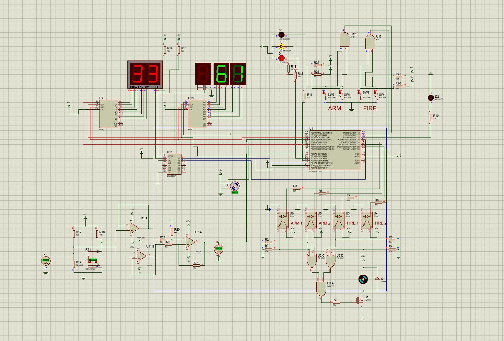

# Ejercicio personal — Simulación funcional en Proteus

Proyecto académico de Ingeniería Electrónica realizado por **Raúl Martínez Martínez, Miguel Vela García y Julen Lorenzo Moa**. Se incorpora como muestra de integración de electrónica y programación de un microcontrolador. La aportación principal de Raúl Martínez Martínez fue la programación del microcontrolador.

- [Memoria revisada](FTS_Proteus.pdf)
- [Código fuente del proyecto](codigo/main.ino)
- [Paquete original de Proteus](Proyecto_FTS.zip) y [contenido descomprimido](proyecto/)
- [Captura del circuito en Proteus](figuras/circuito_proteus.jpeg)
- [Diagrama funcional actualizado](figuras/diagrama_flujo.pdf)

## Objetivo y alcance

El trabajo representa en Proteus una versión didáctica y simplificada de un sistema de terminación de vuelo (FTS). Las órdenes se introducen mediante interruptores y la salida se representa con un motor DC. La documentación describe una simulación funcional, sin ensayos de hardware ni validación para un vehículo real.

También incorpora una PT100 simulada y un servomotor que representa una compuerta de ventilación. La apertura depende de la temperatura introducida manualmente; no se modela la refrigeración que produciría la compuerta.

## Qué se ha integrado

| Bloque | Trabajo realizado |
|---|---|
| Entrada analógica | PT100, puente de Wheatstone y acondicionamiento con amplificadores operacionales; conversión de la lectura ADC a temperatura |
| Microcontrolador | ATmega328P programado mediante registros, con configuración de puertos, ADC, temporizadores e interrupciones |
| Visualización | Temperatura, apertura y estados mediante displays de siete segmentos, registros 4094, multiplexado y LEDs |
| Actuador proporcional | Generación de la señal del servomotor y relación entre temperatura medida y apertura |
| Simulación funcional | Coordinación de las entradas digitales, estados indicados y salida sobre el motor de demostración |

## Comprobaciones descritas en la memoria

El informe recoge la variación de la temperatura visualizada al modificar la PT100, la indicación de signo negativo, la respuesta proporcional del servomotor y la visualización de estados. Explica asimismo los problemas de integración encontrados con el servo, el multiplexado y la selección de dígitos.

Estas comprobaciones se presentan como las descritas por los autores. El material disponible no incluye una nueva ejecución de Proteus ni registros temporales que permitan verificar cuantitativamente los retardos.

## Correspondencia entre memoria y proyecto

El anexo de la memoria se ha sustituido por las 534 líneas del archivo fuente incluido en el proyecto. Se ha verificado su correspondencia con el código original, omitiendo comentarios y espaciado para la comparación. Ahora recoge la histéresis térmica, `bloqueo_secuencia` y la indicación de fallo basada en `tempready`.

La memoria identifica la aportación principal al código y presenta un diagrama funcional actualizado. Se ha retirado del diagrama la comprobación de batería, que no está implementada, y se ha aclarado que los bucles limitan la duración mediante iteraciones, sin atribuirles tiempos medidos. El código original se conserva.

El [diagrama en PNG](figuras/diagrama_flujo.png) y su [fuente LaTeX/TikZ](figuras/diagrama_flujo.tex) acompañan al PDF vectorial.

## Archivos y entorno del proyecto

| Archivo | Contenido |
|---|---|
| [Proyecto_FTS.zip](Proyecto_FTS.zip) | Paquete original recibido, conservado byte a byte |
| [proyecto/ROOT.DSN](proyecto/ROOT.DSN) | Esquema de Proteus |
| [proyecto/PROJECT.XML](proyecto/PROJECT.XML) y [proyecto/FIRMWARE.XML](proyecto/FIRMWARE.XML) | Metadatos del proyecto |
| [proyecto/FIRMWARE/ATmega328P.XML](proyecto/FIRMWARE/ATmega328P.XML) | Configuración del microcontrolador y de compilación |
| [proyecto/FIRMWARE/ATmega328P/main.ino](proyecto/FIRMWARE/ATmega328P/main.ino) | Fuente original con su codificación de caracteres |
| [codigo/main.ino](codigo/main.ino) | Copia del mismo código en UTF-8 para facilitar su lectura en GitHub |
| [proyecto/FIRMWARE/ATmega328P/Debug/Debug.elf](proyecto/FIRMWARE/ATmega328P/Debug/Debug.elf) | Ejecutable original incluido en el paquete |

La configuración identifica un ATmega328P a 16 MHz y el compilador `Arduino AVR (Proteus)`. El programa utiliza `setup()` y `loop()`. El directorio `proyecto/` conserva los ocho archivos originales del ZIP, incluidos los auxiliares.

Se ha comprobado la integridad del ZIP y la equivalencia de la copia UTF-8 con la fuente original. El proyecto no se ha abierto ni ejecutado de nuevo en Proteus y el ELF se conserva como el binario recibido, sin afirmar que se haya recompilado desde esta fuente. El paquete aportado no contiene un archivo independiente con extensión `.pdsprj`.
